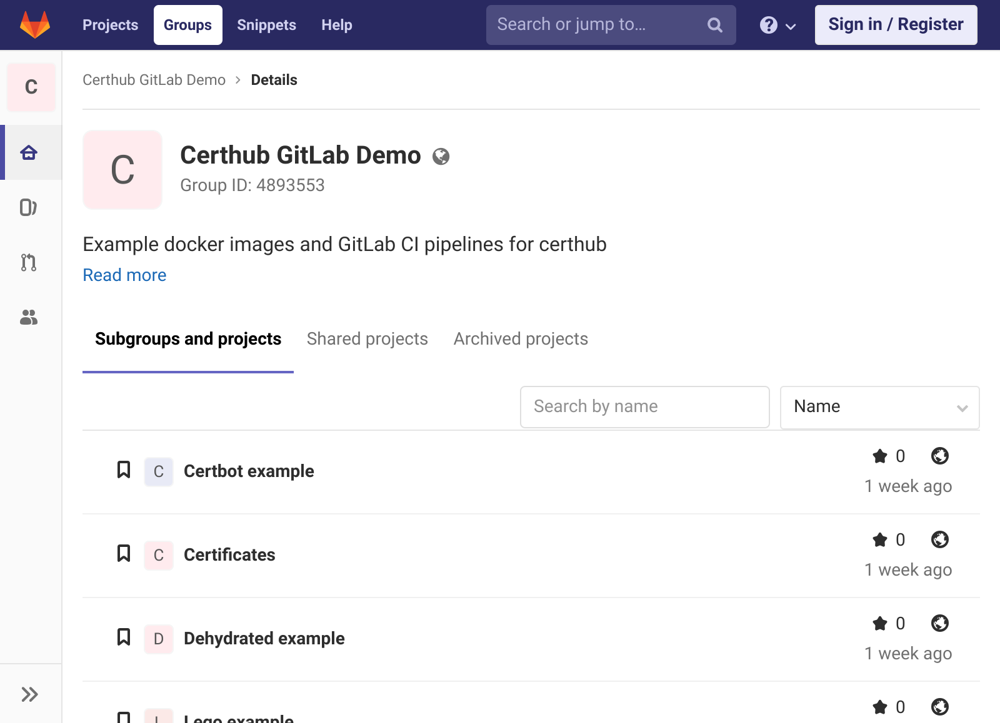
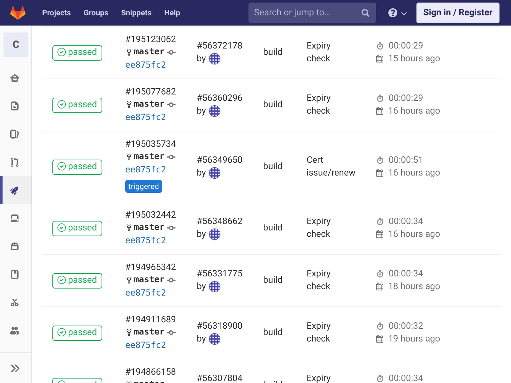
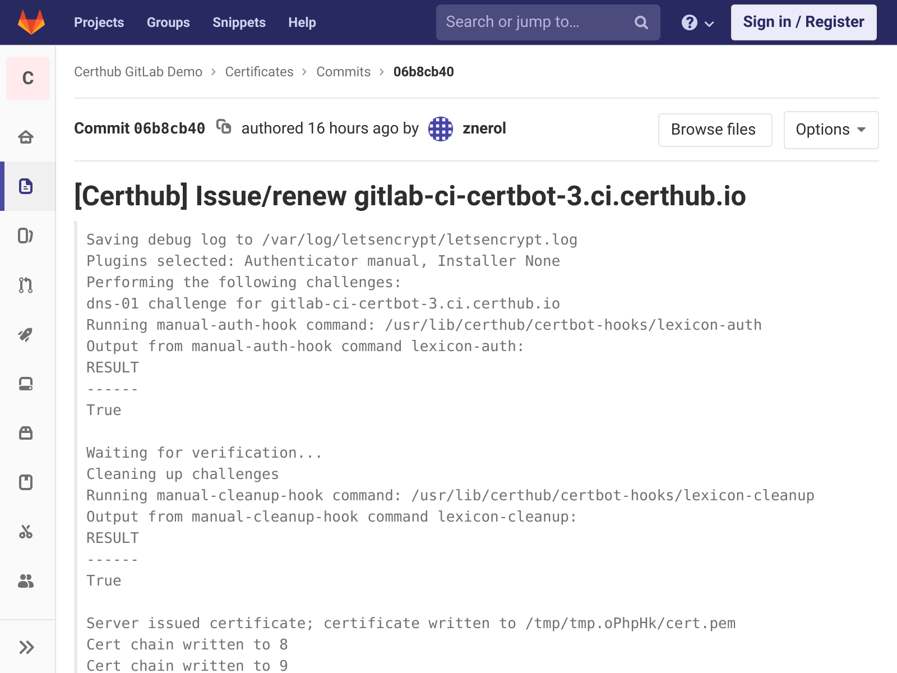

GitLab CI Setup
===============

Certhub provides official `docker images <https://hub.docker.com/r/certhub/certhub>`__
which can be used as part of a CI pipeline to generate and renew certificates.
The images are designed to be fully configurable via environment variables.

.. Hint:: A working demo setup can be found on `gitlab.com/certhub-gitlab-demo <https://gitlab.com/certhub-gitlab-demo>`__

.. Caution:: Do not use public/shared CI runners when generating production certificates.

Big Picture
-----------

A typical setup consists of two repositories. One for the CI pipeline (i.e.,
the Certhub Controller) and a second one for the certificates.

The CI pipeline itself consists of two jobs: *Cert issue/renew* which only runs
when triggered and *Expiry check* which only runs when scheduled. If the
*Expiry Check* job detects that a certificate is about to expire, it triggers
the *Cert issue/renew* job.

If the *Cert isuse/renew* job successfully optains a certificate, it gets
pushed to the certificate repository.

Certificates Repository
-----------------------

In order to setup the certificate repository on gitlab, follow these steps:

1. first create a new project and initialize the repository with a first
   commit. E.g., add a README file linking to this guide.
2. Generate a new SSH key pair and add the public part as a
   `deploy key <https://docs.gitlab.com/ee/ssh/#per-repository-deploy-keys>`__
   to the newly created certificates project. Store the private part of the key
   in a safe place.

.. Hint:: There are many options to deploy certificates pushed to this
   repository. Some ideas:

   * Setup `repository mirroring <https://docs.gitlab.com/ee/workflow/repository_mirroring.html#pushing-to-a-remote-repository-core>`__
     to push certificates to certhub nodes.
   * `Trigger <https://docs.gitlab.com/ee/ci/triggers/#triggering-a-pipeline>`__
     other CI Pipelines to rebuild and deploy applications / docker images.
   * Setup `Webhooks <https://docs.gitlab.com/ee/user/project/integrations/webhooks.html>`__
     to notify the sysops team.

CI Pipeline Repository
----------------------

In order to setup the controller repository and its CI pipeline follow these
steps:

1. First create a new project and initialize the repository with a first
   commit. E.g., add a README file linking to this guide.
2. Add a `new trigger <https://docs.gitlab.com/ee/ci/triggers/#adding-a-new-trigger>`__
   and copy the resulting token.
3. Navigate to `environment variables <https://docs.gitlab.com/ee/ci/variables/#via-the-ui>`__
   section and add the trigger token to a new variable named
   ``PRIVATE_PIPELINE_TOKEN``. Also add the private part of the deploy key as a
   variable with the name ``PRIVATE_SSH_KEY``.

   .. image:: imgs/gitlabci-21-ci-variables.png

4. Optional but recommended: Enable the *Protected* option on those variables
   and setup
   `branch protection <https://docs.gitlab.com/ee/user/project/protected_branches.html>`__
   for the master branch in order to reduce the risk of leaking credentials.

CI Pipeline Configuration
-------------------------

Use one of ``certhub/certhub:certbot`` , ``certhub/certhub:dehydrated`` or
``certhub/certhub:lego`` as the base image depending on preference and
integration needs. In order to simplify interaction with DNS providers,
`lexicon <https://pypi.org/project/dns-lexicon/>`__ is packaged with all images
except for the ``lego``-one.

The following code example represents the overall architecture of the CI
pipeline. The global ``variables`` section contains connection parameters for
the certificates repository, as well as variables defining the repository
structure. Note that the ``CERT_SLUG`` variable will typically be defined
manually in the GUI when issuing renewing a certificate for the first time or
when setting up a scheduled job. Refer to the variables section of
`git-gau-docker-entry.1 <https://github.com/znerol/git-gau/blob/master/doc/git-gau-docker-entry.1.md#variables>`__
and the certhub :doc:`man` for detailed information about available
environment variables.

The *Cert issue/renew* job is configured to be skipped in a scheduled pipeline
run, and it is only executed when ``CERT_SLUG`` environment variable is set
(See `only/except <https://docs.gitlab.com/ee/ci/yaml/#onlyexcept-advanced>`__
docs for more information).  The commit message can be customized using
variables used by :doc:`certhub-message-format.1`. Note that the git commits
are attributed to the user which triggered a pipeline by leveraging
`predefined variables <https://docs.gitlab.com/ee/ci/variables/predefined_variables.html>`__
``GITLAB_USER_NAME`` and ``GITLAB_USER_EMAIL``.

The *Expiry check* job on the other hand is configured to only run in a
scheduled pipeline. The only responsibility is to trigger the CI pipeline
whenever the certificate pointed to by ``CERT_SLUG`` is about to expire. Refer
to :doc:`certhub-cert-expiry.1` for information about available configuration
options via environment variables.

.. code-block:: yaml

   image: certhub/certhub:certbot
   #image: certhub/certhub:dehydrated
   #image: certhub/certhub:lego

   variables:
     # 1. Change Git URL of the certificates repository.
     GAU_REPO: git@gitlab.com:certhub-gitlab-demo/certs.git
     GAU_SSH_PRIVKEY: "${PRIVATE_SSH_KEY}"
     # 2. Use ssh-keyscan to determine the SSH keys of the machine hosting the
     # certificates repository.
     GAU_SSH_KNOWNHOSTS: |
       gitlab.com ssh-ed25519 AAAAC3NzaC1lZDI1NTE5AAAAIAfuCHKVTjquxvt6CM6tdG4SLp1Btn/nOeHHE5UOzRdf
       gitlab.com ssh-rsa AAAAB3NzaC1yc2EAAAADAQABAAABAQCsj2bNKTBSpIYDEGk9KxsGh3mySTRgMtXL583qmBpzeQ+jqCMRgBqB98u3z++J1sKlXHWfM9dyhSevkMwSbhoR8XIq/U0tCNyokEi/ueaBMCvbcTHhO7FcwzY92WK4Yt0aGROY5qX2UKSeOvuP4D6TPqKF1onrSzH9bx9XUf2lEdWT/ia1NEKjunUqu1xOB/StKDHMoX4/OKyIzuS0q/T1zOATthvasJFoPrAjkohTyaDUz2LN5JoH839hViyEG82yB+MjcFV5MU3N1l1QL3cVUCh93xSaua1N85qivl+siMkPGbO5xR/En4iEY6K2XPASUEMaieWVNTRCtJ4S8H+9
       gitlab.com ecdsa-sha2-nistp256 AAAAE2VjZHNhLXNoYTItbmlzdHAyNTYAAAAIbmlzdHAyNTYAAABBBFSMqzJeV9rUzU4kWitGjeR4PWSa29SPqJ1fVkhtj3Hw9xjLVXVYrU9QlYWrOLXBpQ6KWjbjTDTdDkoohFzgbEY=
     CERTHUB_CERT_PATH: "{WORKDIR}/${CERT_SLUG}.fullchain.pem"
     CERTHUB_CSR_PATH: "${CERT_SLUG}.csr.pem"
     CERTHUB_CERT_EXPIRY_TTL: 2592000

   Cert issue/renew:
     stage: build

     only:
       variables:
         - $CERT_SLUG

     except:
       refs:
         - schedules

     variables:
       CERTHUB_MESSAGE_SUBJECT_ACTION: "Issue/renew ${CERT_SLUG}"

       # 3. Configuration for acme client goes here
       #    [...]

     before_script:
       - git config user.name "${GITLAB_USER_NAME}"
       - git config user.email "${GITLAB_USER_EMAIL}"

     script:
       - >
         git gau-ac
         git gau-xargs -I{WORKDIR}
         certhub-message-format "${CERTHUB_CERT_PATH}" x509
         # 4. Invocation of acme client goes here
         #    [...]

   Expiry check:
     stage: build

     only:
       variables:
         - $CERT_SLUG
       refs:
         - schedules

     variables:
       PIPELINE_TOKEN: "${PRIVATE_PIPELINE_TOKEN}"

     script:
       - >
         git gau-xargs -I{WORKDIR}
         certhub-cert-expiry "${CERTHUB_CERT_PATH}" "${CERTHUB_CERT_EXPIRY_TTL}"
         curl -X POST -F "token=${PIPELINE_TOKEN}" -F "ref=${CI_COMMIT_REF_NAME}" -F "variables[CERT_SLUG]=${CERT_SLUG}" "${CI_API_V4_URL}/projects/${CI_PROJECT_ID}/trigger/pipeline"

CI Pipeline Certbot
-------------------

This section needs work. Please refer to the
`certbot example <https://gitlab.com/certhub-gitlab-demo/certbot/blob/master/.gitlab-ci.yml>`__
on gitlab.com and :doc:`certhub-docker-entry.8`.

CI Pipeline Dehydrated
----------------------

This section needs work. Please refer to the
`dehydrated example <https://gitlab.com/certhub-gitlab-demo/dehydrated/blob/master/.gitlab-ci.yml>`__
on gitlab.com and :doc:`certhub-docker-entry.8`.

CI Pipeline Lego
----------------

This section needs work. Please refer to the
`lego example <https://gitlab.com/certhub-gitlab-demo/lego/blob/master/.gitlab-ci.yml>`__
on gitlab.com and :doc:`certhub-docker-entry.8`.

Gitlab CI Usage
===============

In order to setup a new certificate follow these steps:

1. Generate a new private key and a CSR. Store the private key in a safe place
   and deploy it to the servers / services where the certificate will be used.
2. Add the CSR to the repository (file extension: ``.csr.pem``). Note the
   basename, this will be used as the value of the ``CERT_SLUG`` variable in
   subsequent steps.
3. Add acme client specific configuration files to the repository if necessary,
   (e.g., ``$CERT_SLUG.certbot.ini`` or ``$CERT_SLUG.dehydrated.conf``).
4. Run the CI pipeline once manually, set the variable ``CERT_SLUG`` in the GUI:

   .. image:: imgs/gitlabci-41-run-pipeline.png

5. Add a schedule if the pipeline was successfull.

   .. image:: imgs/gitlabci-42-edit-schedule.png

6. Expiry checks can also be triggered manually from the schedule overview page.

   .. image:: imgs/gitlabci-43-list-schedules.png
